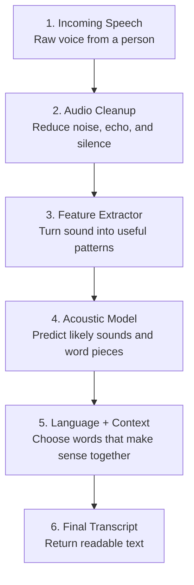

# Speech Recognition: How AI Listens

**An open-source interactive learning resource by AI with Enoch.**

This project explains how speech recognition turns human voice into text, using a practical, visual, hands-on presentation built for the **Youth in AI Series: Practical AI Skills for Social Impact**.

## Open the Live Presentation

Use the Vercel frontend to view and present the workshop:

**[Launch the interactive presentation](https://speechrecognitionpresentation.vercel.app)**

GitHub is the source and documentation home.  
Vercel is the polished frontend experience.

## What This Teaches

This workshop breaks down what happens when someone speaks to Siri, Google Assistant, a voice bot, or a voice-to-text app.

Learners explore:

- how microphones capture speech
- how sound becomes digital data
- how spectrograms show sound patterns
- how AI recognises speech
- why accents, speed, slang, and background noise affect accuracy
- how speech recognition is used in education, healthcare, customer support, accessibility, business, and public services
- how platforms like ElevenLabs, OpenAI Audio, Deepgram, AssemblyAI, Google Speech-to-Text, and Azure Speech fit into the voice AI pipeline

## How It Works: The Speech Recognition Pipeline

Unlike a person who hears meaning naturally, a speech recognition system has to process voice step by step.

This project includes a lightweight client-side simulator that shows the pipeline without requiring an API key, login, or paid platform.



### Pipeline Breakdown

| Stage | What Happens | Simple Example |
| --- | --- | --- |
| 1. Incoming Speech | A person speaks into a phone, laptop, headset, or smart speaker. | "Please send the class recording to my WhatsApp." |
| 2. Audio Cleanup | The system tries to reduce noise, silence, echo, and messy background sound. | Room noise becomes less important than the voice. |
| 3. Feature Extractor | The audio is split into tiny pieces and converted into sound patterns. | The system notices rhythm, pitch, and frequency shapes. |
| 4. Acoustic Model | AI predicts likely sounds, syllables, or word pieces from those patterns. | It hears something like "class recording". |
| 5. Language + Context | The system uses context to choose the most sensible sentence. | "class recording" is more likely than "glass recording". |
| 6. Final Transcript | The best text version is returned for captions, search, summaries, bots, or actions. | `Please send the class recording to my WhatsApp.` |

The important idea: speech recognition is not magic. It is a sequence of small guesses that become more confident as more context is added.

## Who This Is For

This resource is designed for:

- young people learning practical AI
- non-technical students
- educators and workshop facilitators
- community AI programs
- beginners curious about voice AI
- people building AI solutions for social impact

## What Is Inside

The presentation includes:

- a 40-minute workshop flow
- audience-facing explanations
- GitHub README pipeline breakdown
- no-API tap-through simulations
- animated voice wave to transcript breakdown
- one-on-one voice assistant conversation simulation
- voice-to-text mini demo
- sample phrase fallback for browsers without microphone access
- human recognizer activity
- real-life application examples
- platform lab for practical tools
- Word Error Rate calculator
- responsible AI notes
- source links and further references

## Workshop Breakdown

| Section | What It Covers |
| --- | --- |
| Opening | What speech recognition is and why it matters |
| Voice-to-text | The basic meaning of speech recognition |
| Pipeline | Sound waves, digital audio, spectrograms, and pattern matching |
| GitHub pipeline guide | Speech, cleanup, features, model, context, and transcript explained step by step |
| No-API simulations | Tap-through voice wave and voice assistant conversation demos |
| Interactive demo | Live microphone transcription and sample phrase fallback |
| Human recognizer challenge | Why noisy speech creates different interpretations |
| Modern AI | How neural networks improved speech recognition |
| Real-life applications | Education, healthcare, accessibility, support, public services, and business |
| Platform lab | ElevenLabs, OpenAI Audio, Deepgram, AssemblyAI, Google Speech-to-Text, and Azure Speech |
| Accuracy | Word Error Rate and why mistakes matter |
| Practical decisions | Cloud vs on-device, privacy, consent, cost, accents, and local vocabulary |

## Hands-On Activities

### 1. GitHub Pipeline Breakdown

Learners can review the README diagram that shows the main stages:

```text
incoming speech -> audio cleanup -> feature extraction -> acoustic model -> language context -> transcript
```

Each stage explains what happens to the voice before readable text appears.

### 2. Tap-Through Voice Wave Simulation

Learners watch a spoken sentence move through five visible stages:

```text
voice -> wave -> digital numbers -> sound patterns -> transcript
```

This works without microphone access or external APIs.

### 3. One-on-One Voice Assistant Simulation

Learners tap through a simple conversation and see how a voice agent moves from listening to transcription, intent detection, details, and response.

Example request:

```text
Please book my haircut for Friday at 4 pm.
```

### 4. Voice-to-Text Mini Demo

Learners speak into the browser and watch speech become text.

Example sentence:

```text
ModSapp can reply to customers at eleven pm.
```

### 5. Human Recognizer Challenge

Learners compare what people hear when a sentence is spoken clearly, quickly, quietly, or with background noise.

Example phrases:

```text
I scream for ice cream.
recognize speech
```

### 6. Word Error Rate Calculator

Learners compare a correct sentence with a machine transcript and see how substitutions, deletions, and insertions affect accuracy.

### 7. Platform Lab

Learners see how different tools handle different parts of voice AI:

| Platform | Demonstrates |
| --- | --- |
| Chrome Web Speech | quick browser transcription |
| Deepgram | live transcription |
| AssemblyAI | transcription and audio analysis |
| Google Speech-to-Text | custom vocabulary and multilingual speech |
| Azure Speech | enterprise speech services |
| OpenAI Audio / Realtime | speech-to-text, reasoning, and spoken response |
| ElevenLabs | realistic text-to-speech and voice agents |

## Real-Life Applications

Speech recognition appears in:

- voice assistants
- live captions
- online classes
- lecture transcription
- call centers
- customer service bots
- healthcare note-taking
- accessibility tools
- translation systems
- voice search
- smart cars
- public service access
- business order capture

## Project Structure

```text
speechrecognitionpresentation/
|-- index.html              # Interactive presentation frontend
|-- README.md               # Project overview and learning breakdown
|-- docs/
|   `-- workshop-guide.md   # Detailed workshop guide
|-- package.json            # Project metadata
|-- vercel.json             # Static Vercel configuration
|-- LICENSE                 # MIT license
`-- .gitignore
```

## Local Use

Open `index.html` in a modern browser.

Chrome is recommended for the built-in microphone demo because browser speech recognition support varies.

## Deployment

This is a static HTML project. It can be deployed on:

- Vercel
- GitHub Pages
- Netlify
- Cloudflare Pages
- any static web host

Current live deployment:

[https://speechrecognitionpresentation.vercel.app](https://speechrecognitionpresentation.vercel.app)

## Responsible AI Notes

Speech recognition is useful, but it should be used carefully.

Important principles:

- Get consent before recording or transcribing people.
- Do not clone or synthesize someone's voice without permission.
- Check transcripts before using them in medical, legal, financial, or high-stakes settings.
- Test with different accents, noisy environments, and local vocabulary.
- Give users a way to correct mistakes.
- Treat transcripts as helpful outputs, not automatic truth.

## Repository

GitHub:

[https://github.com/aiwithenoch/speechrecognitionpresentation](https://github.com/aiwithenoch/speechrecognitionpresentation)

Live frontend:

[https://speechrecognitionpresentation.vercel.app](https://speechrecognitionpresentation.vercel.app)

## License

MIT
